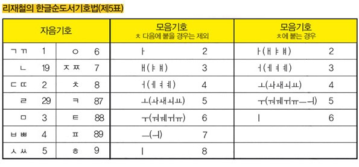

# Book_callnumber
리재철 한글순도서기호법(제5표)에 따른 도서 청구기호 분류입니다.

# 설치 및 사용방법
## 설치
     $sudo pip3.5 install hangul-utils


## hangul.py
 리재철 한글순도서기호법 제 5표에 따른 청구기호 분류입니다
 리재철 한글순도서기호법 제 5표에 따르면, 청구 기호는 '카테고리 +저자첫글자명(first)+저자두번째글자의기호화(second)+도서명의첫자음(book_first)+기타' 로 구성됩니다
 기타에는 중복된 책인경우 두 번째 도서는 c2, 세 번째는 c3로 표기합니다.

 예를 들어 ,저자의 성에 해당하는 ‘이’를 그대로 쓰고 이름의 첫 자인 ‘찬’에서 ‘ㅊ’에 해당하는 8과 ‘ㅏ’에 해당하는 2을 붙여 ‘이82’로 쓴다.
 마지막에는 책 제목의 첫 글자인 ‘파’에서 초성인 ‘ㅍ’을 붙인다. 결국 ‘이82ㅍ’이 된다.



### library에 책이름, 저자명 입력 

```
library = [{'book': 'UX 디자인 불변의 법칙', 'author': '에릭 리스 '},  
           {'book' : '자바의신', 'author' : '이상민'}]
```

### 저자 두번째글자의 기호화 (second)

저자명의 두번째가 'ㅊ' 인지 아닌지에 따라 뒤의 모음기호가 달라집니다
*all_num2(ip)* 저자명의 두번째 글자 자음이 ㅊ이 아닌경우,<br>
*ch_num2(ip)*는 저자명의 두번째 글자 자음이 ㅊ인 경우

### 저자명 공란 없애기
```
for i in init:
  i['author'] = i['author'].replace(" ", "")
  author = i['author']
  book = i['book']
```
저자 두번째 글자가 비어있으면 에러가 발생하므로 공란을 없애주고
key값이 'author' 인 value자체를 author로,
key값이 'book' 인 value자체를 book으로 정의

### 자음모음분리

```
jamo = split_syllables(author[1])
  jamo_list = list(jamo)
```

```
author = '이찬현'
author[1] = 찬
jamo = split_syllables(author[1])
jamo = ('ㅊ','ㅏ','ㄴ')
jamo list = ['ㅊ','ㅏ,'ㄴ]
```

### 중복된 책인경우
```
cc = 1
if cnt > 1:
    num = num + 'c' + str(cnt)

  sheet.cell(row=cc, column=7, value=num)

  cc += 1
```


### Const

* jamo_list[0] 저자명 두번째 글자의 첫번째 자음
* num1 저자명 두번째 글자에 따른 자음 기호
* num2 저자명 두번째 글자에 따른 모음 기호
* first  저자명 첫번째 글자
* second  num1 + num2
* bookname_first 도서명 첫글자
* cnt 청구기호중 동일한 num의 갯수
* cc 줄